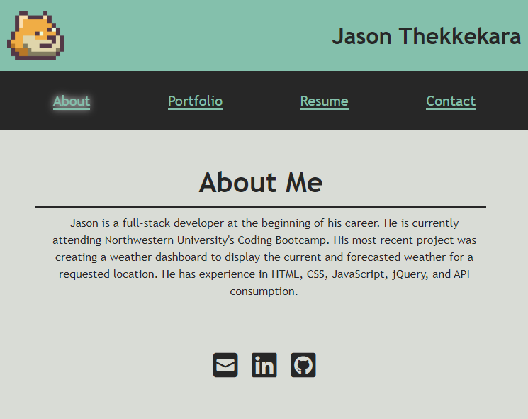

<!--
*** Thanks for checking out the Best-README-Template. If you have a suggestion
*** that would make this better, please fork the repo and create a pull request
*** or simply open an issue with the tag "enhancement".
*** Don't forget to give the project a star!
*** Thanks again! Now go create something AMAZING! :D
-->

<!-- PROJECT SHIELDS -->
<!--
*** I'm using markdown "reference style" links for readability.
*** Reference links are enclosed in brackets [ ] instead of parentheses ( ).
*** See the bottom of this document for the declaration of the reference variables
*** for contributors-url, forks-url, etc. This is an optional, concise syntax you may use.
*** https://www.markdownguide.org/basic-syntax/#reference-style-links
-->

[![Contributors][contributors-shield]][contributors-url]
[![Forks][forks-shield]][forks-url]
[![Stargazers][stars-shield]][stars-url]
[![Issues][issues-shield]][issues-url]
[![MIT License][license-shield]][license-url]
[![LinkedIn][linkedin-shield]][linkedin-url]

<h3 align="center">React Portfolio</h3>

  

    <a href="https://github.com/jathek/react-portfolio"><strong>Explore the docs »</strong></a>
     
    <a href="https://portfolio.jathek.com/">View Portfolio</a>
    ·
    <a href="https://github.com/jathek/react-portfolio/issues">Report Bug</a>
  

<!-- TABLE OF CONTENTS -->

  
Table of Contents

  <ol>
    <li>
      <a href="#about-the-project">About the Project</a>
      <ul>
        <li><a href="#built-with">Built With</a></li>
      </ul>
    </li>
    <!-- <li>
      <a href="#getting-started">Getting Started</a>
      <ul>
        <li><a href="#prerequisites">Prerequisites</a></li>
        <li><a href="#installation">Installation</a></li>
      </ul>
    </li> -->
    <li><a href="#usage">Usage</a></li>
    <li><a href="#license">License</a></li>
    <li><a href="#contact">Contact</a></li>
    <li><a href="#acknowledgments">Acknowledgments</a></li>
  </ol>

<!-- ABOUT THE PROJECT -->

## About the Project

A project portfolio written in React.

    

### Built With

* [JavaScript](https://www.ecma-international.org/publications-and-standards/standards/ecma-262/)
* [Node.js](https://nodejs.org/en/)
  * [React](https://reactjs.org/)
* [Font Awesome](https://fontawesome.com/)
* [PNGOUT](http://advsys.net/ken/utils.htm)

(<a href="#top">back to top</a>)

<!-- GETTING STARTED -->
<!-- ## Getting Started -->
<!-- ### Prerequisites -->

<!-- ### Installation -->

<!-- 
(<a href="#top">back to top</a>)
 -->

<!-- USAGE EXAMPLES -->

## Usage

Visit the portfolio [here](https://portfolio.jathek.com/).

(<a href="#top">back to top</a>)

<!-- LICENSE -->

## License

Distributed under the MIT License. See `LICENSE.txt` for more information.

(<a href="#top">back to top</a>)

<!-- CONTACT -->

## Contact

Jason Thekkekara - [LinkedIn][linkedin-url] - [Github](https://github.com/jathek)

Project Link: [https://github.com/jathek/react-portfolio](https://github.com/jathek/react-portfolio)

(<a href="#top">back to top</a>)

<!-- ACKNOWLEDGMENTS -->

## Acknowledgments

- [othneildrew/Best-README-Template](https://github.com/othneildrew/Best-README-Template)

(<a href="#top">back to top</a>)

<!-- MARKDOWN LINKS & IMAGES -->
<!-- https://www.markdownguide.org/basic-syntax/#reference-style-links -->

[contributors-shield]: https://img.shields.io/github/contributors/jathek/react-portfolio.svg?style=for-the-badge
[contributors-url]: https://github.com/jathek/react-portfolio/graphs/contributors
[forks-shield]: https://img.shields.io/github/forks/jathek/react-portfolio.svg?style=for-the-badge
[forks-url]: https://github.com/jathek/react-portfolio/network/members
[stars-shield]: https://img.shields.io/github/stars/jathek/react-portfolio.svg?style=for-the-badge
[stars-url]: https://github.com/jathek/react-portfolio/stargazers
[issues-shield]: https://img.shields.io/github/issues/jathek/react-portfolio.svg?style=for-the-badge
[issues-url]: https://github.com/jathek/react-portfolio/issues
[license-shield]: https://img.shields.io/github/license/jathek/react-portfolio.svg?style=for-the-badge
[license-url]: https://github.com/jathek/react-portfolio/blob/main/LICENSE.txt
[linkedin-shield]: https://img.shields.io/badge/-LinkedIn-black.svg?style=for-the-badge&logo=linkedin&colorB=555
[linkedin-url]: https://linkedin.com/in/jason-thekkekara
[product-screenshot]: https://raw.githubusercontent.com/jathek/react-portfolio/main/assets/readme/full-page-screenshot.png
